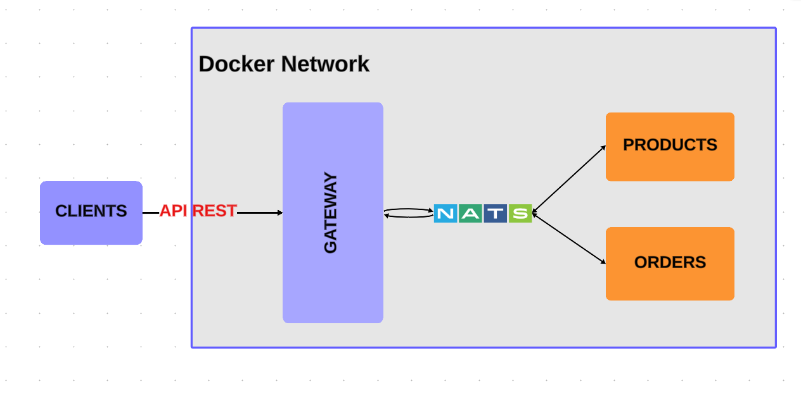

# Prueba Tecnica Gestion de productos

1. Clonar el repositorio
2. Crear un .env basado en el .env.template
3. Ejecutar el comando `git submodule update --init --recursive` para reconstruir los sub-módulos
4. Ejecutar el comando `docker compose up --build`


### Pasos para crear los Git Submodules

1. Crear un nuevo repositorio en GitHub
2. Clonar el repositorio en la máquina local
3. Añadir el submodule, donde `repository_url` es la url del repositorio y `directory_name` es el nombre de la carpeta donde quieres que se guarde el sub-módulo (no debe de existir en el proyecto)
```
git submodule add <repository_url> <directory_name>
```
4. Añadir los cambios al repositorio (git add, git commit, git push)
Ej:
```
git add .
git commit -m "Add submodule"
git push
```
5. Inicializar y actualizar Sub-módulos, cuando alguien clona el repositorio por primera vez, debe de ejecutar el siguiente comando para inicializar y actualizar los sub-módulos
```
git submodule update --init --recursive
```
6. Para actualizar las referencias de los sub-módulos
```
git submodule update --remote
```


## Importante
Si se trabaja en el repositorio que tiene los sub-módulos, **primero actualizar y hacer push** en el sub-módulo y **después** en el repositorio principal. 

Si se hace al revés, se perderán las referencias de los sub-módulos en el repositorio principal y tendremos que resolver conflictos.


## Nota


Ademas de eso, la coleccion del postman esta agrago para que solo sea exportarlo y probar todos los enpoints.
Nombre del archivo **REST API MS - Gestion Productos.postman_collection**


# Prod

1. Clonar el repositorio
2. Crear un .env basado en el .env.template
3. Ejecutar el comando
```
docker compose -f docker-compose.prod.yml build
```


### Arquictectura de la prueba


[link donde se realizo el diagrama, click aqui](https://lucid.app/lucidspark/9c6ceccc-061c-4668-8887-4d003116d65c/edit?viewport_loc=-4261%2C-1581%2C5637%2C2853%2C0_0&invitationId=inv_d9e3dcb4-9262-404a-85dd-3d8071d0dd2e)

### Video funcionalidad

[Video para ver la funcionalidad, click aqui](https://youtu.be/lMrWxIgSdyA)